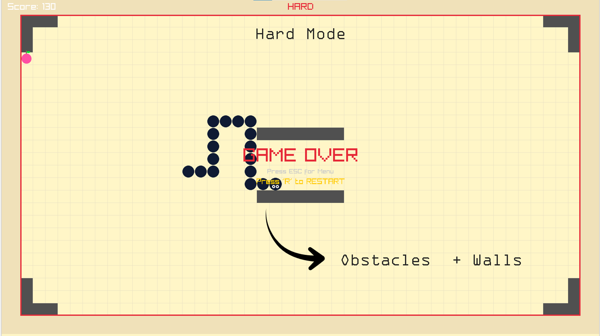

# 🐍 Snake Game — Ultimate Version

> **Created by Group 404 Not Found:**
> Muneeb ur Rehman | Muhammad Umais | Sadia Sahar

A feature-rich implementation of the classic **Snake** game written in **C++** using the **Raylib** library. This project goes beyond the basics with multiple game modes (Easy / Normal / Hard / Story), persistent save & high-score systems, dynamic themes, and polished visuals.

---

## 📐 Project Architecture & Overview

We engineered this game using a structured **Game Loop** that handles Initialization, Updates (input/logic), and Drawing phases separately, rather than a simple linear script.

| **The Interface (Main Menu)** | **The Engineering (Logic Flowchart)** |
| :---: | :---: |
|  |  |
| *Interactive menu system for modes and settings.* | *The complete architecture of the game loop and state machine.* |

---

## 🎮 Gameplay Features Showcase

We implemented dynamic systems to make the game feel polished and varied.

### 🎨 Dynamic Themes
Players can switch visuals instantly to keep the game looking fresh.

| **Classic Green Theme** | **Desert Theme** |
| :---: | :---: |
|  |  |

### ⚙️ Modes & Mechanics Deep Dive
Different modes change the fundamental rules of the game grid.

| **Easy Mode (Wrap-Around)** | **Hard Mode (Obstacles)** | **Core Mechanics** |
| :---: | :---: | :---: |
|  |  |  |
| *Pac-man style borders. Safe for beginners.* | *Static hurdles spawn that must be avoided.* | *Grid-based movement and tail-following logic.* |

---

## 🚀 Key Technical Features

* **4 Game Modes:** Easy, Normal, Hard, and a progressive Story Mode.
* **💾 Save & Load:** Story mode features **auto-save**, allowing you to continue progress across sessions.
* **🏆 High Score Tracking:** Persistently saves your best runs to `highscore.txt` using C++ file handling.
* **🧠 State Management:** Clean separation between Menu, Gameplay, and Game Over states to prevent logic bugs.

---

## 🛠️ Prerequisites & Installation

### Core Tools
* **C++ compiler:** `g++` (MinGW on Windows), `clang`, or MSVC.
* **IDE:** Visual Studio Code (Recommended).

### Required Library
* **Raylib:** Used for graphics, input, and audio handling.
    * [Download Raylib Releases](https://github.com/raysan5/raylib/releases)
    * *Tip for Windows:* The **w64devkit** is usually the easiest setup.

---

## ⚙️ Build & Run Instructions

### Command-Line (Windows with MinGW)
```bash
g++ main.cpp -o SnakeGame -lraylib -lgdi32 -lwinmm
./SnakeGame
