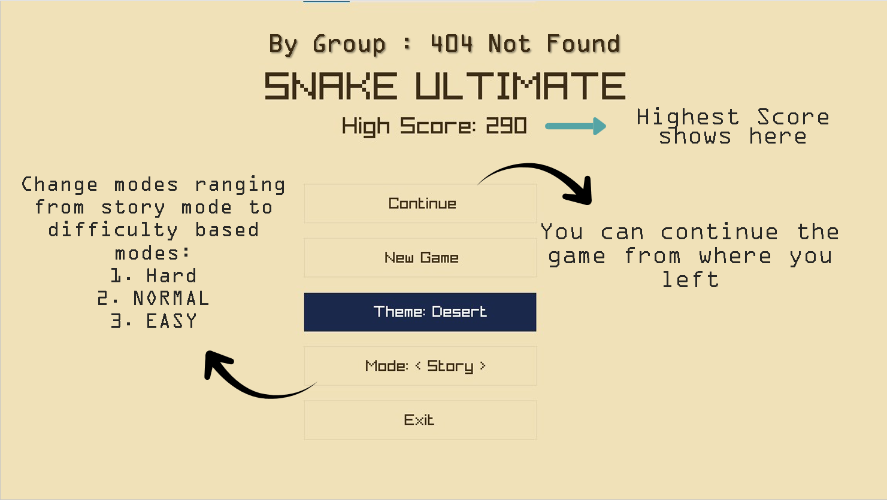
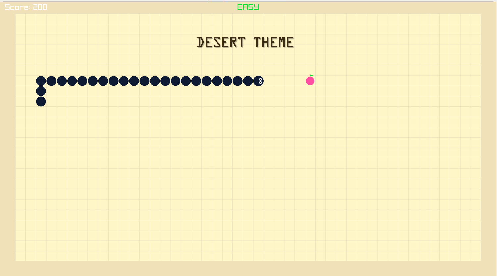
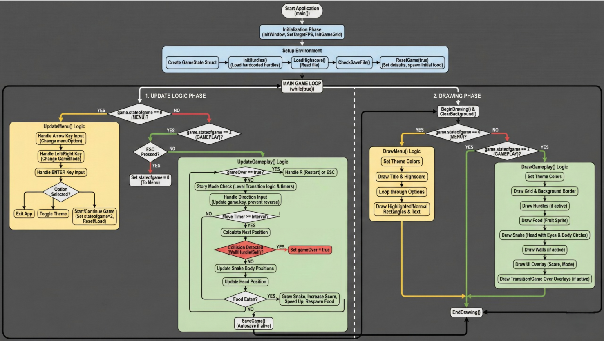

# 🐍 Snake Game — Ultimate Version

> **Created by Group 404 Not Found:** > Muneeb ur Rehman | Muhammad Umais | Sadia Sahar

A feature-rich implementation of the classic **Snake** game written in **C++** using the **Raylib** library. This project goes beyond the basics with multiple game modes (Easy / Normal / Hard / Story), persistent save & high-score systems, dynamic themes, and polished visuals.

---

## 📸 Demo & Architecture

### Gameplay Preview
| Main Menu | Dynamic Themes |
| :---: | :---: |
|  |  |

### Game Logic (The Engineering)
Unlike simple clones, this game runs on a structured **Game Loop** handling Initialization, Updates, and Drawing phases separately.


---

## 🚀 Features

* **4 Game Modes**
    * **Easy:** Wrap-around movement (Pac-Man style). No walls.
    * **Normal:** Standard rules. Walls are fatal.
    * **Hard:** Walls + static obstacles to navigate around.
    * **Story:** Progressive difficulty that changes with your score.
* **💾 Save & Load:** Story mode features **auto-save**, allowing you to continue progress across sessions.
* **🏆 High Score Tracking:** Persistently saves your best runs to `highscore.txt`.
* **🎨 Dynamic Themes:** Switch visuals instantly (e.g., Classic Green vs. Desert).
* **⚙️ Polished Mechanics:** Smooth eye-movement animations and grid-based collision logic.

---

## 🎮 Controls

| Key | Action |
| :--- | :--- |
| **Arrow Keys** | Move snake (Up / Down / Left / Right) |
| **Enter** | Select menu option |
| **ESC** | Pause / Return to menu |
| **R** | Restart (visible on Game Over screen) |

---

## 🛠️ Prerequisites

### Core Tools
* **C++ compiler:** `g++` (MinGW on Windows), `clang`, or MSVC.
* **Code editor:** Visual Studio Code (Recommended).

### Required Library
* **Raylib:** This project uses Raylib for graphics, input, and audio.
    * [Download Raylib Releases](https://github.com/raysan5/raylib/releases)
    * *Tip:* On Windows, the **w64devkit** installer is the easiest route.

---

## 📂 Folder Structure

```text
Project Folder/
├── main.cpp          # Source code entry point
├── lib/              # Raylib library files (e.g., libraylib.a)
├── include/          # raylib.h and other headers
├── assets/           # Store your images (Menu.png, etc.) here
├── savefile.txt      # (Auto-created) Story progress
├── highscore.txt     # (Auto-created) Persistent high score
└── .vscode/          # VS Code tasks / launch configs
